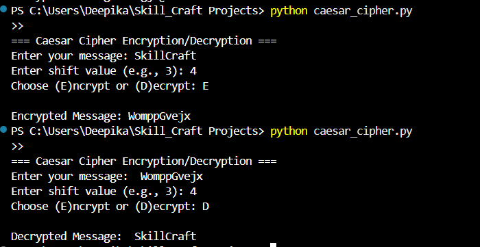

# SCT_CS_1
Task 1 of my internship – Caesar Cipher encryption &amp; decryption tool in Python
You can edit it directly from GitHub.
Example content:

# SCT_CS_1
## Caesar Cipher Encryption & Decryption

This is my **Task 1** for the Software Engineering Internship.  
It implements a Caesar Cipher algorithm in Python.

### 🔹 How to Run
1. Install Python 3.x on your system.
2. Run the program:
   ```bash
   python caesar_cipher.py


Enter your message and shift value.

Choose whether to Encrypt or Decrypt.

🔹 Features

Encrypts text with a shift value.

Decrypts text with the same shift value.

Handles uppercase & lowercase letters.
## 🔥 Demo
Here’s how the Caesar Cipher program works:


